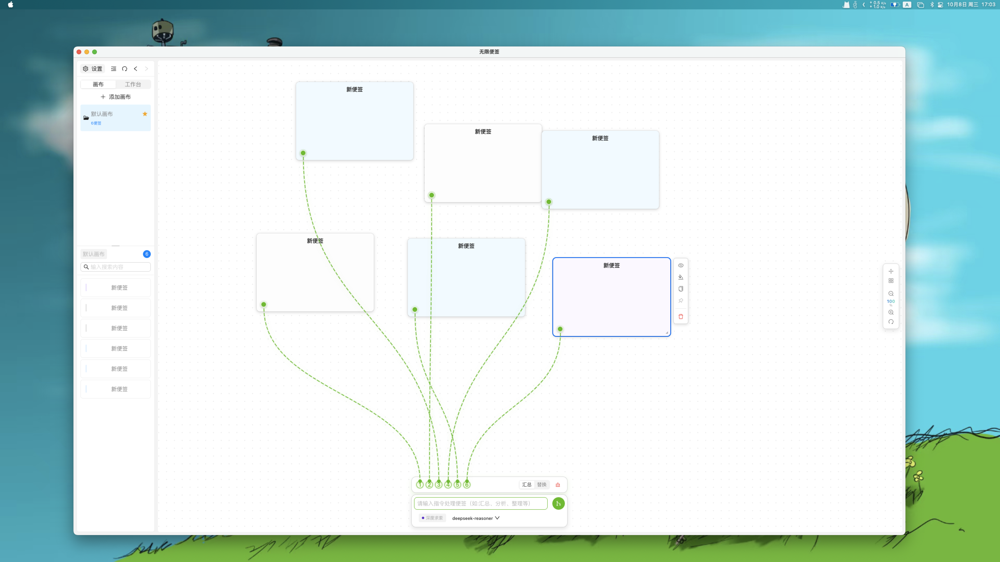

# 无限便签 (InfinityNote)

> 🚀 **现代化无限画布便签应用** - 支持 AI 生成、思维链可视化、多主题的智能便签工具

<div align="center">

[](https://github.com/duobaobox/infinitynote2)
[](LICENSE)
[](https://www.typescriptlang.org/)
[](https://reactjs.org/)
[](https://vitejs.dev/)
[](https://www.electronjs.org/)

[English](./README_EN.md) | 简体中文

</div>

## 📸 应用截图

> 💡 **提示**: 建议在 `/docs/screenshots/` 目录下添加应用截图展示核心功能



## 🎯 项目简介

无限便签是一款基于 Electron + React 的跨平台无限画布便签应用，专为知识管理和创意思考而设计。它将传统便签的灵活性与现代 AI 技术结合，提供流畅的使用体验和强大的功能。

## ✨ 核心特性

### 🎨 无限画布体验

- **自由布局**: 无限画布空间，自由拖拽、缩放便签
- **可视化连接**: 使用连接线建立便签之间的关系
- **画布导航**: 快速缩放、平移、定位到便签

### 🤖 AI 智能助手

- **多提供商支持**: OpenAI、Claude、DeepSeek、智谱 AI、通义千问、Kimi 等
- **流式生成**: 实时显示 AI 生成内容，体验流畅
- **思维链可视化**: 直观展示 AI 的思考推理过程
- **自定义模板**: 内置多种提示词模板，支持自定义

### ⚡ 高效编辑

- **富文本编辑**: 基于 TipTap 的强大编辑器
- **Markdown 支持**: 快捷键、语法高亮、实时预览
- **快捷操作**: 撤销/重做、快捷键、拖拽排序

### 🎭 个性化定制

- **多主题**: 明亮/暗黑主题自动切换
- **便签样式**: 11 种预设颜色，自定义标签分类
- **本地存储**: 基于 IndexedDB，数据安全可靠

## 🛠️ 技术栈

### 核心框架

- **React 19.1.1** - 最新版本的 React 框架
- **TypeScript 5.8.3** - 类型安全的 JavaScript
- **Vite 7.1.2** - 下一代前端构建工具

### UI & 交互

- **Ant Design 5.27.3** - 企业级 UI 组件库
- **TipTap 3.4.2** - 现代化富文本编辑器
- **@dnd-kit** - 拖拽交互库

### 状态管理 & 存储

- **Zustand 5.0.8** - 轻量级状态管理
- **Dexie 4.2.0** - IndexedDB 封装库

### AI 集成

- **多提供商支持** - OpenAI、Anthropic、DeepSeek、智谱 AI 等
- **流式处理** - 实时内容生成和显示
- **思维链** - AI 推理过程可视化

## 🚀 快速开始

### 📥 安装应用

#### 下载预构建版本（推荐）

前往 [Releases](https://github.com/duobaobox/infinitynote2/releases) 页面下载适合您系统的安装包：

**macOS**:

- Apple Silicon (M1/M2/M3): `无限便签-2.0.0-arm64.dmg`
- Intel 芯片: `无限便签-2.0.0.dmg`

详细安装说明请查看 [INSTALL.md](./INSTALL.md)

**Windows** (即将推出):

- `无限便签 Setup 2.0.0.exe`

**Linux** (即将推出):

- `无限便签-2.0.0.AppImage`

### 🛠️ 从源码构建

#### 环境要求

- Node.js >= 20.19.0
- npm >= 10.0.0

#### 安装与运行

```bash
# 1. 克隆项目
git clone https://github.com/duobaobox/infinitynote2.git
cd infinitynote2

# 2. 安装依赖
npm install

# 3. 启动开发服务器（Web 版）
npm run dev

# 4. 或启动 Electron 开发环境（推荐）
npm run electron:dev
```

#### 构建应用

```bash
# 构建 Web 版本
npm run build

# 构建 Electron 应用（根据当前系统）
npm run electron:build

# 构建特定平台
npm run electron:build:mac     # macOS
npm run electron:build:win     # Windows
npm run electron:build:linux   # Linux
```

### ⚙️ 配置 AI 服务

1. 启动应用后，点击右上角设置图标
2. 在「AI 配置」选项卡中：
   - 选择您的 AI 提供商（OpenAI、Claude、DeepSeek 等）
   - 输入 API 密钥
   - 选择模型（如 gpt-4、claude-3-opus 等）
3. 保存配置后即可使用 AI 功能

> 💡 **提示**: API 密钥仅存储在本地，不会上传到任何服务器

## � 使用文档

### 基础操作

- **创建便签**: 双击画布空白处 或 点击工具栏「新建」按钮
- **编辑便签**: 点击便签进入编辑模式
- **移动便签**: 拖拽便签标题栏
- **调整大小**: 拖拽便签边缘
- **删除便签**: 点击便签右上角删除按钮
- **创建连接**: 从便签边缘的连接点拖拽到另一个便签

### AI 功能

- **AI 生成**: 选中文本后点击 AI 图标，或使用快捷键
- **查看思维链**: 启用「显示思维链」选项查看 AI 推理过程
- **停止生成**: 生成过程中点击「停止」按钮

### 键盘快捷键

- `Ctrl/Cmd + Z`: 撤销
- `Ctrl/Cmd + Y`: 重做
- `Ctrl/Cmd + S`: 保存（自动保存）
- `Ctrl/Cmd + F`: 搜索便签
- `Esc`: 退出编辑模式

## 📁 项目结构

```
infinitynote2/
├── electron/              # Electron 主进程和预加载脚本
├── src/
│   ├── components/        # React 组件
│   │   ├── NoteCard/      # 便签卡片组件
│   │   ├── TiptapEditor/  # 富文本编辑器
│   │   ├── AIInlineControl/ # AI 控制面板
│   │   └── ...
│   ├── services/          # 业务服务层
│   │   ├── ai/            # AI 提供商实现
│   │   ├── aiService.ts   # AI 服务统一接口
│   │   └── templateService.ts
│   ├── store/             # Zustand 状态管理
│   │   ├── canvasStore.ts # 画布状态
│   │   ├── noteStore.ts   # 便签状态
│   │   └── historyStore.ts # 历史记录
│   ├── hooks/             # 自定义 Hooks
│   ├── utils/             # 工具函数
│   ├── types/             # TypeScript 类型定义
│   └── theme/             # 主题配置
├── tests/                 # 测试文件
├── docs/                  # 文档
└── public/                # 静态资源
```

## � 开发与测试

### 运行测试

```bash
# 运行所有测试
npm run test

# 性能基准测试
npm run test:performance

# 打包大小分析
npm run test:bundle
```

### 代码质量

```bash
# 代码检查
npm run lint

# 自动修复代码问题
npm run lint:fix

# 类型检查
npm run type-check
```

## �🤝 贡献指南

我们欢迎所有形式的贡献！无论是报告 Bug、提出新功能建议，还是提交代码。

### 如何贡献

1. **Fork** 本仓库
2. 创建您的特性分支 (`git checkout -b feature/AmazingFeature`)
3. 提交您的更改 (`git commit -m 'Add some AmazingFeature'`)
4. 推送到分支 (`git push origin feature/AmazingFeature`)
5. 开启一个 **Pull Request**

### 开发规范

- 遵循项目的代码风格（使用 ESLint）
- 为新功能编写测试
- 更新相关文档
- 确保所有测试通过
- 提交信息清晰明了

详细贡献指南请查看 [CONTRIBUTING.md](./CONTRIBUTING.md)（即将添加）

### 报告问题

发现 Bug？请通过 [Issues](https://github.com/duobaobox/infinitynote2/issues) 报告，并包含：

- 问题描述
- 复现步骤
- 预期行为
- 实际行为
- 系统环境（OS、Node.js 版本等）
- 截图或错误信息（如有）

## 🗺️ 开发路线

- [ ] **v2.1**: 客户端增加桌面悬浮便签功能
- [ ] **v2.2**: 提示词模板功能完善
- [ ] **v2.3**: 工作台功能开发（待收集的功能，欢迎反馈）
- [ ] **v2.4**: 云同步功能开发
- [ ] **v2.5**: 回收站功能开发
- [ ] **v3.0**: 画布分享功能开发

查看详细的 [Roadmap](https://github.com/duobaobox/infinitynote2/projects) 和 [更新日志](./CHANGELOG.md)

## 📄 许可证

本项目采用 [MIT](LICENSE) 许可证 - 详见 LICENSE 文件

Copyright © 2025 [duobaobox](https://github.com/duobaobox)

## 🙏 鸣谢

感谢以下开源项目：

- [React](https://reactjs.org/) - 用户界面构建库
- [Electron](https://www.electronjs.org/) - 跨平台桌面应用框架
- [Ant Design](https://ant.design/) - 企业级 UI 组件库
- [TipTap](https://tiptap.dev/) - 无头富文本编辑器
- [Zustand](https://github.com/pmndrs/zustand) - 轻量级状态管理
- [Vite](https://vitejs.dev/) - 新一代前端构建工具
- [Dexie.js](https://dexie.org/) - IndexedDB 封装库
- [leader-line](https://anseki.github.io/leader-line/) - 连接线绘制库

## � 社区与支持

- 📮 **问题反馈**: [GitHub Issues](https://github.com/duobaobox/infinitynote2/issues)
- 💡 **功能建议**: [GitHub Discussions](https://github.com/duobaobox/infinitynote2/discussions)
- 📧 **联系作者**: 通过 GitHub Profile 联系

## ⭐ Star History

如果这个项目对您有帮助，请给我们一个 ⭐！

[](https://star-history.com/#duobaobox/infinitynote2&Date)

---

<div align="center">

**用 ❤️ 制作 | Made with Love**

[回到顶部](#infinitynote-2) ↑

</div>
