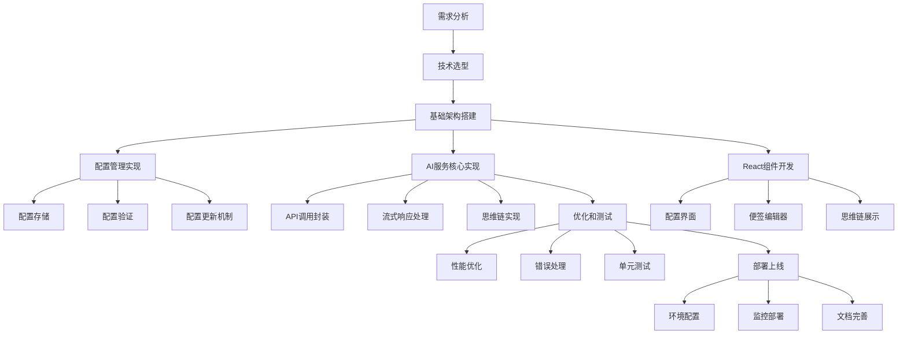

# AI 功能完整技术文档

## 目录

1. [开发流程概述](#1-开发流程概述)
2. [技术架构设计](#2-技术架构设计)
3. [核心功能实现](#3-核心功能实现)
4. [关键技术细节](#4-关键技术细节)
5. [踩坑经验总结](#5-踩坑经验总结)
6. [测试与部署](#6-测试与部署)
7. [优化与展望](#7-优化与展望)

## 1. 开发流程概述

### 1.1 开发流程图



### 1.2 开发阶段说明

1. **需求分析阶段**

   - 功能需求梳理
   - 技术要求确定
   - 性能指标定义

2. **技术选型**

   - React + TypeScript
   - Vite 构建工具
   - TipTap 编辑器
   - IndexedDB 存储

3. **关键决策**
   - 使用流式响应提升体验
   - 采用 XML 格式处理思维链
   - 实现预连接机制
   - 使用单例模式管理配置

## 2. 技术架构设计

### 2.1 核心模块

1. **AI 服务模块** (`AIService`)

   - 处理 AI API 调用
   - 便签生成流程
   - 思维链处理

2. **配置管理模块** (`AIConfigManager`)

   - 统一配置管理
   - 配置更新通知
   - 全局配置一致性

3. **数据存储模块** (`IndexedDBAISettingsStorage`)

   - 配置持久化
   - 本地数据管理

4. **React 集成** (`useAISettings`)
   - 配置状态管理
   - 组件生命周期
   - 错误处理

### 2.2 关键数据结构

```typescript
// AI配置接口
interface AIConfig {
  apiUrl: string; // API地址
  apiKey: string; // API密钥
  aiModel: string; // AI模型名称
  enableAI?: boolean; // 是否启用AI
  temperature?: number; // AI温度参数
  maxTokens?: number; // 最大token数
  systemPrompt?: string; // 系统提示词
  summaryMode?: "full" | "final_answer_only"; // 总结模式
}

// 便签数据结构
interface StickyNoteData {
  title: string;
  content: JSONContent; // TipTap JSON格式
  color?: string;
  tags?: string[];
  thinkingChain?: {
    id: string;
    prompt: string;
    steps: Array<{
      id: string;
      content: string;
      stepType: "analysis" | "reasoning" | "conclusion" | "question" | "idea";
      timestamp: Date;
      order: number;
    }>;
    totalThinkingTime: number;
    createdAt: Date;
  };
  hasThinking?: boolean;
}

// 流式状态接口
interface StreamingState {
  currentNoteIndex: number;
  currentNoteContent: string;
  isStreamingNote: boolean;
  thinkingContent: string;
  hasStartedThinking: boolean;
  hasFinishedThinking: boolean;
  displayedContent: string;
  showThinkingMode: boolean;
}
```

## 3. 核心功能实现

### 3.1 基础架构搭建

1. **项目初始化**

```bash
# 创建项目
npm create vite@latest infinity-notes -- --template react-ts

# 安装核心依赖
npm install @tiptap/react @tiptap/starter-kit
npm install indexeddb-promise
npm install rxjs # 用于事件处理
```

2. **目录结构**

```

```

### 3.2 AI 服务实现

1. **服务初始化与配置**

```typescript
class AIService {
  private config: AIConfig;
  private preconnectController: AbortController | null = null;
  private isPreconnected: boolean = false;

  constructor(config: AIConfig) {
    this.config = config;
  }

  async preconnectToAI(): Promise<void> {
    if (this.isPreconnected) return;
    // 实现预连接逻辑...
  }

  validateConfig(): boolean {
    return !!(this.config.apiKey && this.config.apiUrl && this.config.aiModel);
  }
}
```

2. **流式响应处理**

```typescript
async generateStickyNotesStreaming(
  prompt: string,
  callbacks: StreamingCallbacks,
  options?: { showThinkingMode?: boolean }
): Promise<{
  success: boolean;
  notes?: StickyNoteData[];
  error?: string;
}> {
  const streamingState: StreamingState = {
    currentNoteIndex: 0,
    currentNoteContent: "",
    isStreamingNote: false,
    thinkingContent: "",
    hasStartedThinking: false,
    hasFinishedThinking: false,
    displayedContent: "",
    showThinkingMode: options?.showThinkingMode ?? true
  };

  try {
    // 实现流式生成逻辑...
  } catch (error) {
    // 错误处理...
  }
}
```

### 3.3 思维链处理

1. **XML 解析实现**

```typescript
private parseThinkingChain(
  response: string,
  originalPrompt: string,
  showThinkingMode: boolean = true
): {
  thinkingChain?: StickyNoteData["thinkingChain"];
  cleanContent: string;
} {
  const thinkingPatterns = [
    /<thinking>([\s\S]*?)<\/thinking>/gi,
    /<think>([\s\S]*?)<\/think>/gi
  ];

  for (const pattern of thinkingPatterns) {
    const match = response.match(pattern);
    if (match && match[1]) {
      const thinkingContent = match[1].trim();
      const cleanContent = response.replace(pattern, "").trim();
      // 处理思维链内容...
      return {
        thinkingChain: {/*...*/},
        cleanContent
      };
    }
  }

  return { cleanContent: response };
}
```

2. **步骤解析实现**

```typescript
private parseThinkingStepsInternal(
  thinkingContent: string
): Array<{
  id: string;
  content: string;
  stepType: "analysis" | "reasoning" | "conclusion" | "question" | "idea";
  timestamp: Date;
  order: number;
}> {
  // 实现步骤解析逻辑...
}
```

## 4. 关键技术细节

### 4.1 流式响应处理

1. **数据流管理**

```typescript
const reader = response.body?.getReader();
const decoder = new TextDecoder();

while (true) {
  const { done, value } = await reader.read();
  if (done) break;

  const chunk = decoder.decode(value, { stream: true });
  // 处理数据块...
}
```

2. **状态管理**

```typescript
if (content) {
  streamingState.currentNoteContent += content;

  if (streamingState.isStreamingNote) {
    if (streamingState.showThinkingMode) {
      // 处理思维模式显示...
    } else {
      // 处理普通模式显示...
    }
  }
}
```

### 4.2 思维链处理

1. **标准化处理**

```typescript
if (reasoningContent) {
  if (!streamingState.hasStartedThinking) {
    streamingState.hasStartedThinking = true;
  }

  streamingState.thinkingContent += reasoningContent;

  if (streamingState.showThinkingMode) {
    if (!streamingState.displayedContent) {
      streamingState.displayedContent = "🤔 **AI正在思考中...**\n\n";
    }
    streamingState.displayedContent += reasoningContent;
  }
}
```

### 4.3 错误处理机制

1. **错误类型**

```typescript
class AIError extends Error {
  constructor(
    message: string,
    public type: "config" | "network" | "api" | "parse",
    public details?: any
  ) {
    super(message);
    this.name = "AIError";
  }
}
```

2. **统一处理**

```typescript
class AIErrorHandler {
  static handle(error: any): void {
    if (error instanceof NetworkError) {
      this.handleNetworkError(error);
    } else if (error instanceof APIError) {
      this.handleAPIError(error);
    } else {
      this.handleUnknownError(error);
    }
  }
}
```

## 5. 踩坑经验总结

### 5.1 流式响应相关

1. **数据解析问题**

- **问题**: 流式数据可能出现不完整的 JSON 片段
- **解决方案**:

```typescript
let buffer = "";
for (const line of chunk.split("\n")) {
  buffer += line;
  try {
    const data = JSON.parse(buffer);
    buffer = ""; // 解析成功后清空缓冲区
    // 处理数据
  } catch {
    // JSON不完整，继续累积
    continue;
  }
}
```

2. **连接中断处理**

- **问题**: 网络不稳定导致流式传输中断
- **解决方案**:

```typescript
async function withRetry<T>(
  operation: () => Promise<T>,
  maxRetries: number = 3
): Promise<T> {
  for (let i = 0; i < maxRetries; i++) {
    try {
      return await operation();
    } catch (error) {
      if (i === maxRetries - 1) throw error;
      await new Promise((resolve) =>
        setTimeout(resolve, 1000 * Math.pow(2, i))
      );
    }
  }
  throw new Error("Max retries reached");
}
```

### 5.2 思维链解析问题

1. **格式不一致**

- **问题**: 不同 AI 模型返回的思维链格式不同
- **解决方案**: 实现适配器模式

2. **内容混淆**

- **问题**: 思维过程和最终答案混在一起
- **解决方案**: 使用明确的分隔标记

### 5.3 性能优化问题

1. **内存泄漏**

- **问题**: 流式响应长时间运行导致内存累积
- **解决方案**: 实现清理机制和监控

2. **响应延迟**

- **问题**: 首次调用 API 响应慢
- **解决方案**: 实现预连接和预热机制

## 6. 测试与部署

### 6.1 测试策略

1. **单元测试**

```typescript
describe("AIConfig Validation", () => {
  test("should validate required fields", () => {
    const config: AIConfig = {
      apiUrl: "",
      apiKey: "",
      aiModel: "",
    };

    const validator = new AIConfigValidator();
    const result = validator.validateConfig(config);

    expect(result.isValid).toBeFalsy();
    expect(result.errors).toContain("API密钥不能为空");
  });
});
```

2. **集成测试**

- API 连接测试
- 流式响应测试
- 错误处理测试

3. **端到端测试**

- 完整功能流程测试
- 用户界面交互测试
- 性能和稳定性测试

### 6.2 部署配置

1. **环境配置**

```typescript
const config = {
  development: {
    apiUrl: "http://dev-api.example.com",
    maxTokens: 2000,
    temperature: 0.7,
  },
  production: {
    apiUrl: "https://api.example.com",
    maxTokens: 1000,
    temperature: 0.5,
  },
};
```

2. **监控设置**

- API 响应时间监控
- 错误率监控
- 资源使用监控

## 7. 优化与展望

### 7.1 性能优化

1. **缓存优化**

- 实现多级缓存
- 智能预加载
- 缓存自动清理

2. **并发优化**

- 请求队列
- 并发控制
- 资源复用

### 7.2 功能扩展

1. **AI 模型支持**

- 支持更多 AI 模型
- 模型自动选择
- 多模型协同

2. **交互优化**

- 实时预览
- 智能提示
- 快捷操作

### 7.3 未来规划

1. **架构升级**

- 微服务架构
- 服务端缓存
- 分布式部署

2. **新功能开发**

- 协同编辑
- 离线支持
- 移动端适配

## 结语

本文档详细介绍了 AI 功能的完整实现流程，包括技术架构、核心实现、踩坑经验等方面。通过这些实战经验和最佳实践，其他开发者可以更好地理解和实现类似功能，避免常见问题，提高开发效率和代码质量。
