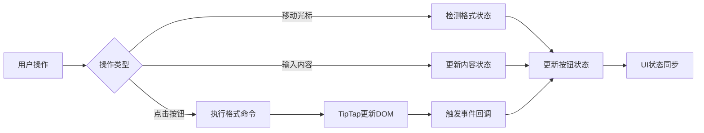

# 便签编辑格式化功能技术方案

## 概述

本文档详细介绍了无限便签项目中便签编辑区域的格式化功能实现，包括组件架构、状态同步机制、TipTap 集成方案等核心技术细节。

## 1. 系统架构

### 1.1 组件层次结构

```
StickyNote (便签容器)
├── SharedNoteEditor (编辑器封装)
│   └── WysiwygEditor/BasicEditor (TipTap实例)
└── BasicToolbar (格式化工具栏)
    ├── 基础格式按钮 (粗体、斜体、删除线等)
    ├── 列表格式按钮 (有序、无序、任务列表等)
    └── 标题格式按钮 (H1、H2、H3等)
```

### 1.2 核心区域划分

- **`basic-editor-content`**: TipTap 编辑器内容区域，负责文本渲染和交互
- **`sticky-note-toolbar-container`**: 格式化工具栏容器，提供格式化按钮 UI

## 2. 格式化功能实现

### 2.1 支持的格式类型

#### 基础文本格式

- **粗体** (`Bold`): `**文本**` → `<strong>文本</strong>`
- **斜体** (`Italic`): `*文本*` → `<em>文本</em>`
- **删除线** (`Strike`): `~~文本~~` → `<s>文本</s>`
- **行内代码** (`Code`): `` `代码` `` → `<code>代码</code>`
- **下划线** (`Underline`): `<u>文本</u>`

#### 块级格式

- **标题** (`Heading`): `# 标题` → `<h1>标题</h1>`
- **无序列表** (`BulletList`): `- 项目` → `<ul><li>项目</li></ul>`
- **有序列表** (`OrderedList`): `1. 项目` → `<ol><li>项目</li></ol>`
- **任务列表** (`TaskList`): `- [ ] 任务` → 可交互复选框列表
- **引用块** (`Blockquote`): `> 引用` → `<blockquote>引用</blockquote>`

#### 高级功能

- **表格** (`Table`): 支持可调整大小的表格
- **图片** (`Image`): 支持图片插入和显示
- **链接** (`Link`): 支持链接创建和编辑

### 2.2 格式化命令实现

#### 基础格式化命令

```typescript
// 粗体切换
editor.chain().focus().toggleBold().run();

// 斜体切换
editor.chain().focus().toggleItalic().run();

// 删除线切换
editor.chain().focus().toggleStrike().run();

// 行内代码切换
editor.chain().focus().toggleCode().run();
```

#### 块级格式化命令

```typescript
// 无序列表切换
editor.chain().focus().toggleBulletList().run();

// 有序列表切换
editor.chain().focus().toggleOrderedList().run();

// 任务列表切换
editor.chain().focus().toggleTaskList().run();

// 引用块切换
editor.chain().focus().toggleBlockquote().run();
```

#### 标题格式化命令

```typescript
// 一级标题
editor.chain().focus().toggleHeading({ level: 1 }).run();

// 二级标题
editor.chain().focus().toggleHeading({ level: 2 }).run();

// 三级标题
editor.chain().focus().toggleHeading({ level: 3 }).run();
```

## 3. 状态同步机制

### 3.1 按钮激活状态检测

项目使用 TipTap 提供的 `isActive()` API 实现格式状态检测：

```typescript
// 检测当前光标位置的格式状态
const buttonStates = {
  bold: editor.isActive("bold"),
  italic: editor.isActive("italic"),
  strike: editor.isActive("strike"),
  code: editor.isActive("code"),
  bulletList: editor.isActive("bulletList"),
  orderedList: editor.isActive("orderedList"),
  taskList: editor.isActive("taskList"),
  blockquote: editor.isActive("blockquote"),
  heading1: editor.isActive("heading", { level: 1 }),
  heading2: editor.isActive("heading", { level: 2 }),
  heading3: editor.isActive("heading", { level: 3 }),
};
```

### 3.2 双向同步实现

#### 内容变化 → 按钮状态更新

```typescript
// TipTap事件监听
const editor = useEditor({
  onSelectionUpdate: ({ editor }) => {
    // 光标移动时检测格式状态
    updateToolbarButtonStates(editor);
  },
  onUpdate: ({ editor }) => {
    // 内容变化时检测格式状态
    updateToolbarButtonStates(editor);
  },
});
```

#### 按钮点击 → 内容格式变化

```typescript
const handleFormatClick = (formatType: string) => {
  switch (formatType) {
    case "bold":
      editor.chain().focus().toggleBold().run();
      break;
    case "italic":
      editor.chain().focus().toggleItalic().run();
      break;
    // ... 其他格式处理
  }

  // 触发状态更新
  updateToolbarButtonStates(editor);
};
```

### 3.3 状态更新流程



## 4. TipTap 集成方案

### 4.1 官方扩展使用

项目使用了以下 TipTap 官方扩展：

#### 核心扩展包 (@tiptap/starter-kit)

- `Document` - 文档根节点
- `Paragraph` - 段落节点
- `Text` - 文本节点
- `Bold` - 粗体标记
- `Italic` - 斜体标记
- `Strike` - 删除线标记
- `Code` - 行内代码标记
- `Heading` - 标题节点
- `BulletList` - 无序列表节点
- `OrderedList` - 有序列表节点
- `ListItem` - 列表项节点
- `Blockquote` - 引用块节点
- `HardBreak` - 强制换行
- `History` - 撤销重做功能

#### 独立扩展包

```typescript
// 表格功能
import { Table } from "@tiptap/extension-table";
import TableRow from "@tiptap/extension-table-row";
import TableCell from "@tiptap/extension-table-cell";
import TableHeader from "@tiptap/extension-table-header";

// 任务列表
import TaskList from "@tiptap/extension-task-list";
import TaskItem from "@tiptap/extension-task-item";

// 媒体和链接
import { Image } from "@tiptap/extension-image";
import { Link } from "@tiptap/extension-link";

// 格式扩展
import { Underline } from "@tiptap/extension-underline";

// UI增强
import { Placeholder } from "@tiptap/extension-placeholder";
```

### 4.2 扩展配置

```typescript
// 统一扩展配置 (src/config/tiptapConfig.ts)
export const UNIFIED_TIPTAP_EXTENSIONS = [
  StarterKit.configure({
    link: false, // 使用自定义Link配置
    underline: false, // 使用独立Underline扩展
  }),
  Table.configure({
    resizable: true,
    HTMLAttributes: { class: "tiptap-table" },
  }),
  TaskList.configure({
    HTMLAttributes: { class: "tiptap-task-list" },
  }),
  TaskItem.configure({
    nested: true,
    HTMLAttributes: { class: "tiptap-task-item" },
  }),
  Image.configure({
    allowBase64: true,
    HTMLAttributes: {
      class: "tiptap-image",
      style: "max-width: 100%; height: auto; display: block; margin: 8px auto;",
    },
  }),
  Link.configure({
    openOnClick: false,
    HTMLAttributes: { class: "tiptap-link" },
  }),
  Underline.configure({
    HTMLAttributes: { class: "tiptap-underline" },
  }),
  Placeholder.configure({
    placeholder: "在这里输入内容...",
    showOnlyWhenEditable: true,
  }),
];
```

### 4.3 编辑器实例化

```typescript
// 编辑器创建 (src/components/notes/BasicEditor.tsx)
const editor = useEditor({
  extensions: UNIFIED_TIPTAP_EXTENSIONS,
  content: normalizedContent,
  editable: editable,
  autofocus: autoFocus,
  onUpdate: ({ editor }) => {
    const json = editor.getJSON();
    onChange?.(json);
  },
  onBlur: () => {
    onBlur?.();
  },
  editorProps: {
    attributes: {
      class: `ProseMirror ${className}`,
    },
    handleKeyDown: (_, event) => {
      if (onKeyDown) {
        const result = onKeyDown(event);
        if (result === true) {
          return true; // 阻止默认行为
        }
      }
      return false; // 允许默认行为
    },
  },
});
```

## 5. 工具栏实现

### 5.1 工具栏组件结构

```typescript
// BasicToolbar组件 (src/components/notes/BasicToolbar.tsx)
interface BasicToolbarProps {
  editor: Editor | null;
  className?: string;
  showDividers?: boolean;
  compactMode?: boolean;
}

const BasicToolbar: React.FC<BasicToolbarProps> = ({
  editor,
  className = "",
  showDividers = true,
  compactMode = false,
}) => {
  // 工具栏实现
};
```

### 5.2 按钮状态管理

```typescript
// 按钮状态检测 (src/utils/tiptapUtils.ts)
export const getToolButtonState = (
  editor: Editor | null,
  toolType: ToolType
): ToolbarButtonState => {
  if (!editor) {
    return {
      isActive: false,
      isDisabled: true,
      canExecute: false,
    };
  }

  const toolConfig = getToolConfig(toolType);

  return {
    isActive: toolConfig?.isActive?.(editor) || false,
    isDisabled: !editor.isEditable,
    canExecute: toolConfig?.canExecute?.(editor) || false,
  };
};
```

### 5.3 命令执行封装

```typescript
// 命令执行器 (src/utils/tiptapUtils.ts)
export const executeToolCommand = (
  editor: Editor | null,
  toolType: ToolType
): CommandResult => {
  if (!editor || !editor.isEditable) {
    return { success: false, error: "编辑器不可用" };
  }

  const toolConfig = getToolConfig(toolType);

  if (!toolConfig) {
    return { success: false, error: `未找到工具配置: ${toolType}` };
  }

  try {
    return toolConfig.execute(editor);
  } catch (error) {
    return {
      success: false,
      error: `工具执行失败: ${String(error)}`,
    };
  }
};
```

## 6. 用户操作流程

### 6.1 格式应用流程

1. **用户选择文本或定位光标**
2. **点击格式化按钮**
3. **执行 TipTap 命令** (`editor.chain().focus().toggleFormat().run()`)
4. **TipTap 更新 DOM 结构** (添加/移除 HTML 标签)
5. **触发更新事件** (`onUpdate`, `onSelectionUpdate`)
6. **同步内容到本地状态** (`localContent`)
7. **更新工具栏按钮状态** (激活/非激活)
8. **防抖保存到数据库** (通过 `EditingPerformanceFix`)

### 6.2 状态检测流程

1. **光标移动或内容变化**
2. **触发 TipTap 事件回调**
3. **调用状态检测函数** (`getToolButtonState`)
4. **使用 `editor.isActive()` 检测格式**
5. **更新按钮 UI 状态** (CSS 类名变化)
6. **提供视觉反馈** (高亮激活按钮)

## 7. 性能优化

### 7.1 状态检测优化

- **防抖机制**: 避免频繁的状态检测调用
- **缓存策略**: 缓存按钮状态避免重复计算
- **智能更新**: 只更新状态变化的按钮

### 7.2 内容同步优化

- **批量更新**: 使用 `EditingPerformanceFix` 合并写入操作
- **本地缓存**: 优先使用内存缓存减少数据库访问
- **异步持久化**: 非阻塞的数据库写入操作

### 7.3 渲染性能优化

```typescript
// 使用React.memo优化工具栏重渲染
const BasicToolbar = memo(({ editor, className }) => {
  // 工具栏实现
});

// 使用useMemo缓存按钮状态
const buttonStates = useMemo(() => {
  return getAllButtonStates(editor);
}, [editor?.state.selection, editor?.state.doc]);
```

## 8. 数据格式与转换

### 8.1 内容格式

- **编辑器内部**: TipTap JSONContent 格式
- **数据库存储**: JSONContent 格式
- **显示渲染**: HTML 格式 (TipTap 自动转换)
- **导出格式**: Markdown 格式 (通过 `ContentFormatService`)

### 8.2 格式转换

```typescript
// Markdown → JSONContent
const jsonContent = ContentFormatService.markdownToJson(markdownText);

// JSONContent → HTML
const htmlContent = editor.getHTML();

// JSONContent → Plain Text
const plainText = editor.getText();

// JSONContent → Markdown
const markdownText = ContentFormatService.jsonToMarkdown(jsonContent);
```

## 9. 错误处理与容错

### 9.1 编辑器异常处理

```typescript
try {
  editor.chain().focus().toggleBold().run();
} catch (error) {
  console.error("格式化命令执行失败:", error);
  // 回退到安全状态
  return { success: false, error: String(error) };
}
```

### 9.2 状态同步容错

```typescript
// 安全的状态检测
const isActive = (formatName: string) => {
  try {
    return editor?.isActive(formatName) || false;
  } catch (error) {
    console.warn(`状态检测失败: ${formatName}`, error);
    return false;
  }
};
```

### 9.3 内容恢复机制

- **自动保存**: 编辑过程中定期保存内容
- **版本回退**: 支持撤销重做操作
- **异常恢复**: 编辑器崩溃时恢复到最后保存状态

## 10. 扩展性设计

### 10.1 新格式支持

添加新的格式化功能只需要：

1. **安装 TipTap 扩展**: `npm install @tiptap/extension-xxx`
2. **添加到扩展配置**: 在 `UNIFIED_TIPTAP_EXTENSIONS` 中配置
3. **更新工具栏**: 在 `BasicToolbar` 中添加按钮
4. **添加命令映射**: 在 `toolbarConfig.ts` 中添加配置

### 10.2 自定义扩展

```typescript
// 自定义扩展示例
const CustomExtension = Extension.create({
  name: "customFormat",

  addOptions() {
    return {
      HTMLAttributes: {},
    };
  },

  addCommands() {
    return {
      toggleCustomFormat:
        () =>
        ({ commands }) => {
          return commands.toggleMark(this.name);
        },
    };
  },
});
```

## 11. 测试策略

### 11.1 单元测试

- **格式化命令测试**: 验证各种格式命令的正确执行
- **状态检测测试**: 验证按钮状态检测的准确性
- **内容转换测试**: 验证格式转换的正确性

### 11.2 集成测试

- **用户操作流程测试**: 端到端的格式化操作测试
- **状态同步测试**: 验证 UI 状态与编辑器状态的同步
- **性能测试**: 验证大量格式操作的性能表现

### 11.3 视觉回归测试

- **工具栏样式测试**: 确保按钮状态的视觉反馈正确
- **格式显示测试**: 确保格式化内容的正确显示
- **跨浏览器测试**: 确保在不同浏览器中的一致性

## 12. 总结

### 12.1 技术优势

- **官方支持**: 基于 TipTap 官方扩展，稳定可靠
- **高度集成**: 与便签系统深度集成，用户体验一致
- **性能优化**: 多层次的性能优化保证流畅体验
- **扩展性强**: 易于添加新的格式化功能

### 12.2 实现特点

- **双向同步**: 内容变化与按钮状态实时同步
- **命令封装**: 统一的命令执行和错误处理机制
- **状态管理**: 智能的按钮状态检测和更新
- **格式丰富**: 支持多种文本和块级格式

### 12.3 维护建议

- **定期更新**: 跟进 TipTap 版本更新，获取新功能和 bug 修复
- **性能监控**: 监控格式化操作的性能，及时优化
- **用户反馈**: 收集用户使用反馈，持续改进体验
- **代码审查**: 定期审查格式化相关代码，保证代码质量

---

**文档版本**: v1.0  
**更新日期**: 2025 年 9 月 14 日  
**维护团队**: Infinity Notes 开发团队
